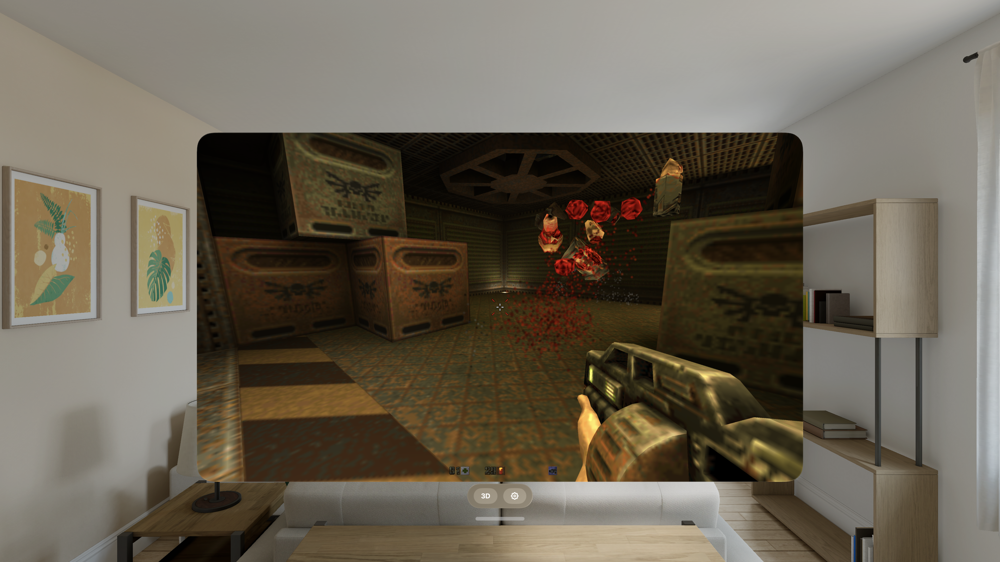

# Quake II (q2repro) for iPhone & Apple Vision Pro

Play **Quake II** on your iPhone and Apple Vision Pro — the full campaign, both
mission packs, the 2023 re-release content, Action Quake II, and a stereoscopic
**3D mode** on Vision Pro that puts the game on a floating screen in your room
with real depth.

Built on [q2repro](https://github.com/Paril/q2repro) (Paril's Q2PRO fork with
Quake II re-release support), rendering natively on Metal via ANGLE.
100% vibe coded with lots of passion and attention to detail.



---

## Install

**Add the SideStore source** — the easiest path, and Quake II auto-updates when new versions ship:

| Device | Source URL |
| --- | --- |
| iPhone / iPad | `https://raw.githubusercontent.com/rebelancap/quake-ports/main/apps-ios.json` |
| Apple Vision Pro | `https://raw.githubusercontent.com/rebelancap/quake-ports/main/apps-visionos.json` |

In [SideStore](https://sidestore.io) / [AltStore](https://altstore.io): *Sources → **+** → paste the URL*, then
install Quake II. These are shared sources — they also carry Quake (vkQuake) and Quake III.

On **Apple Vision Pro**, first install SideStore onto the headset with
[iloader](https://github.com/rebelancap/iloader/releases#release-visionos) (SideStore/AltStore can't be
installed on visionOS the usual way — iloader is what gets SideStore there). Then add the source in
SideStore exactly as above. No Xcode or Dev Strap required.

**Prefer a manual install?** Download `q2repro-*-iOS.ipa` / `q2repro-*-visionOS.ipa` from the
[latest release](../../releases/latest) and install it through SideStore/AltStore yourself (iPhone can
also use [Sideloadly](https://sideloadly.io)).

Then **add your Quake II files** (see below) at first launch, or via the **Files** app →
*On My iPhone / Vision Pro → q2repro* → pick your game folder.

## You bring the game

q2repro ships with **no game content** — you must own Quake II and provide your own
files. Copy one of these into the app's folder:

- **Quake II (2023 re-release)** — Steam/GOG. Highly recommended, especially for
  Vision Pro 3D mode. Pick the `rerelease` folder (containing `baseq2` + `Q2Game.kpf`):
  you get the remastered campaign flow with intro cinematics, the expansions
  *The Reckoning*, *Ground Zero*, *Call of the Machine*, and *Quake II 64* as
  episodes, high-detail (MD5) models, and the full soundtrack.
- **Original Quake II** — a classic `baseq2` folder (`pak0.pak` + friends).

If both are present, the re-release wins. Classic mods drop in the same way — put
each in its own folder and it appears in the in-game **Mods** menu.
**Action Quake II** is built into the app: drop in your Action data
(`action` folder) and launch it from Mods.

Your settings and saves live in a separate `profile` folder, never inside the game
data — safe to swap data sets without losing anything.

## Features

- Full single-player campaign with saves and level transitions; all re-release
  episodes and expansions with their intro cinematics; classic mission packs
- **Action Quake II** compiled in; classic mods via the generated Mods menu
- Music, cinematics, all sound, demo playback, and the full menu/console by touch
  or controller
- **Game controllers** with the re-release's default layout (weapon wheel included);
  on-screen touch sticks, GTA-style weapon-wheel select, gyro aim
- 60 / 120 Hz (ProMotion), in-app settings that persist
- Multiplayer: Q2PRO netcode with a server browser (favorites, LAN, master servers)
- **Apple Vision Pro:** free-resizing 2D window, plus a **3D mode** — the game on a
  world-locked stereoscopic panel floating in your room (mixed immersion), spatial
  audio anchored at the screen, and live-tunable settings while you play: stereo
  depth, crosshair distance, screen size/distance/height (any aspect — ultra-widescreen
  renders true widescreen FOV), surroundings dimming, and a recenter button. The 2D
  window parks as a small control card while you're in 3D.

## Requirements

- iPhone on **iOS 15+**, or **Apple Vision Pro** (visionOS 26+)
- A sideloading tool (SideStore / AltStore) ([iloader](https://github.com/rebelancap/iloader/releases#release-visionos) for visionOS)
- Your own Quake II game files

## FAQ

**Which Quake II data should I use?** The 2023 re-release if you have it — you get
the expansions as integrated episodes, remastered models, and the full campaign
flow. An original `baseq2` also works (classic engine mode).

**Is any game content included?** No. You supply your own files; nothing
copyrighted ships with the app.

**Where do the expansions show up?** With re-release data, open
*Game → Singleplayer → Campaigns & Expansions* — each episode starts with its intro
cinematic, exactly like the Steam release.

**Multiplayer?** Yes — Q2PRO-compatible servers over LAN and internet, plus a
built-in server browser.

**The app stopped launching after about a week?** Apps sideloaded with a free Apple
account expire after 7 days (paid developer accounts last a year). SideStore/iloader
refresh them automatically in the background — open the sideloading app and let it
re-sign.

---

## Building from source

Requires macOS with Xcode, plus `xcodegen` and `cmake` (`brew install xcodegen cmake`).

```sh
scripts/bootstrap.sh             # vendor q2repro @ pin + overlay + deps + project (once)
scripts/build-angle-ios.sh       # ANGLE (GL ES on Metal) for iOS (once)
scripts/build-ffmpeg-ios.sh      # FFmpeg (music + cinematics) for iOS (once)
scripts/build-curl-ios.sh        # libcurl for iOS (once)
scripts/gen-app-project.sh && (cd app && xcodegen generate)   # then build in Xcode

scripts/build-angle-visionos.sh  # visionOS dependencies (once)
scripts/build-ffmpeg-visionos.sh
scripts/build-curl-visionos.sh
scripts/build-visionos.sh        # the merged 2D+3D visionOS app
```

Upstream q2repro is vendored unmodified and pinned by commit; every local change is
a reviewable patch in `overlay/patches/`, applied by `scripts/apply-overlay.sh`.

## Credits & license

- [q2repro](https://github.com/Paril/q2repro) by Paril, built on
  [Q2PRO](https://github.com/skullernet/q2pro) by skuller and contributors
- [Action Quake II (aq2-tng)](https://github.com/actionquake2/aq2-tng) by the AQ2 community
- QUAKE II © id Software
- Licensed under the **GNU GPL v2** (see `LICENSE`), matching upstream Q2PRO.
